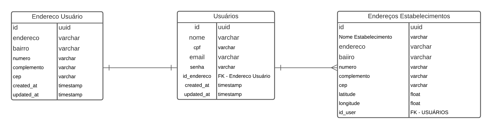
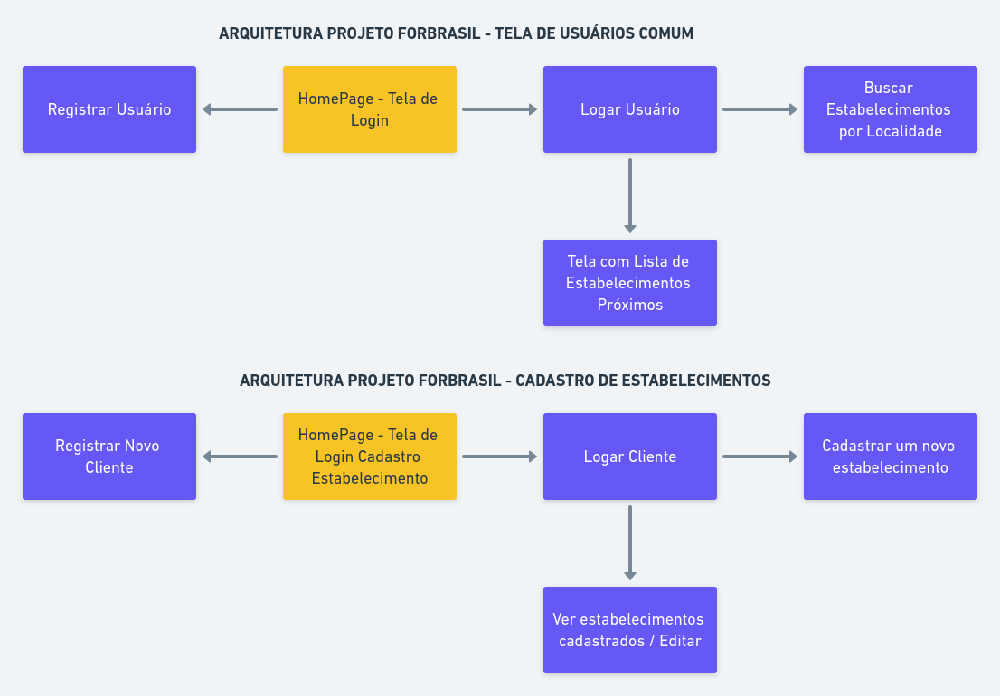

# Projeto
## Descrição
Construir uma aplicação, onde será possível cadastrar novos estabelecimentos
de uma determinada região e pesquisar estabelecimentos por determinadas regiões.
Para ter acesso a essas funcionalidades, o usuário precisa está devidamente 
registrado e autenticado na aplicação, para poder executar as tarefas.

● **Conteinerização da aplicação (Docker)**

## Tecnologias utilizadas

Para o desenvolvimento do projeto foi utilizada as seguintes tecnologias:

- :elephant: **PHP 7.4** 
- :small_red_triangle_down:  **Laravel** — Um framework é um facilitador no desenvolvimento de diversas aplicações e, sem dúvida, sua utilização poupa tempo e custos para quem o utiliza, pois de forma mais básica, é um conjunto de bibliotecas utilizadas para criar uma base onde as aplicações são construídas, um otimizador de recursos.
- :whale2: **Docker** — É um software que garante maior facilidade na criação e administração de ambientes isolados, garantindo a rápida disponibilização de programas para o usuário final.
- :small_red_triangle_down: **VueJs** - Um framework para criação do frontend
da aplicação.
- :small_red_triangle_down: **Figma** - Aplicação para Criação de prototipos 
da parte visual para o usuário.
- :small_red_triangle_down: **Postman** - Um facilitador, para fazer documentações
de APIs, mostrando como deve ser feito o consumo da API.

## Sobre as Escolhas da Linguagens:
As duas frameworks escolhidas, foram escolhidas pois elas são da zona de conforto
do programador, onde ele já possuí um pouco mais de experiência com essas plataformas.
Porém o intuito é as aperfeiçoar em outras plataformas como React e React Native.

## Instalação

1. Clone o Repositório:
> git clone https://github.com/daniloaldm/dockerFileLaravel.git projeto && cd projeto/

2. Após clonar, criar o .env do docker:
> sudo cp .env.example .env

3. Para inicializar o container Docker:
> ./start

4. Para para um container Docker:
> ./stop

5. Para Acessar o Terminal do Docker:
> ./shell

6. Para acessar os arquivos da api, execute o terminal do docker:
> cd src/backend/

7. Para acessar o frontend da aplicação, execute o terminal do docker:
> cd src/frontend/

## Esquema do Banco de Dados

## Fluxograma da APlicação

## Documentação da Api:
[https://documenter.getpostman.com/view/4863125/TVK77Luv#7316a34d-5ef0-4cc8-9803-01101fb46332](https://documenter.getpostman.com/view/4863125/TVK77Luv#7316a34d-5ef0-4cc8-9803-01101fb46332)

## Sobre a API:
A api foi feita em Módulos, exitem dois grandes módulos nesta aplicação que é o módulo
de autenticação, que fica responsável por toda a parte de autenticação do usuário,
verificar dados do usuário, cadastrar novos usuários. E o módulo de estabelecimentos,
responsável por toda a parte do crud de estabelecimentos e da listagem de estabelecimentos
por localidade. Todos os módulos foram programados tentado seguir padrões de TDD e SOLID, 
mas não 100% aplicados, pois é algo que ainda venho estudando, e os dois módulos possuem
teste Unitarios.

## Prototipo da Aplicação no Figma:
[https://www.figma.com/file/3CoZ7U4Yc02xoDodsRhvKx/Projeto-Fortbrasil](https://www.figma.com/file/3CoZ7U4Yc02xoDodsRhvKx/Projeto-Fortbrasil)

## :man_technologist: Autor

- **Daniel Rosendo** - [GitHub](https://github.com/sport129) - Email: [daniel.rosendos@hotmail.com](mailto:daniel.rosendos@hotmail.com)